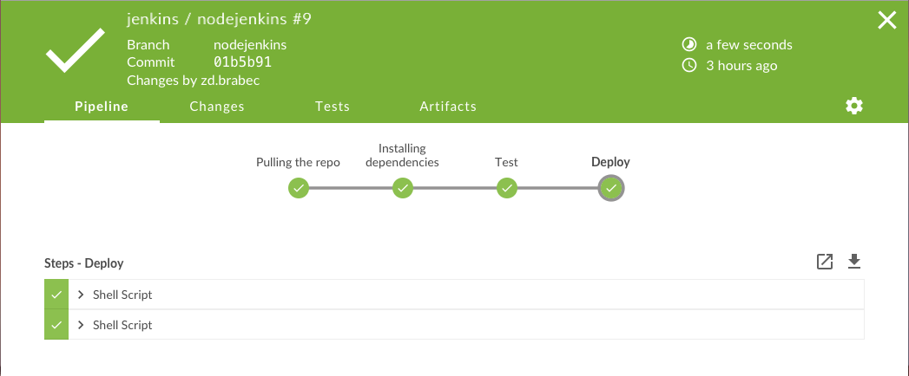
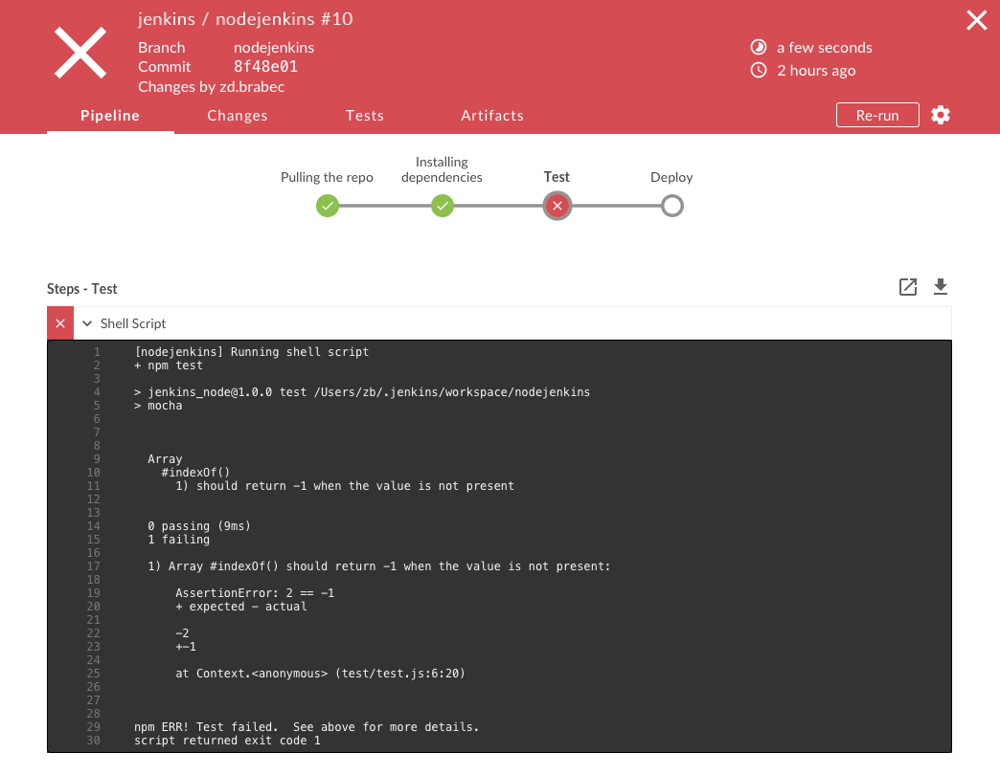
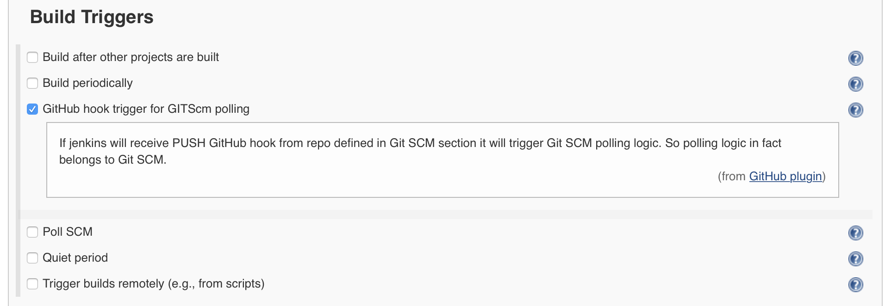
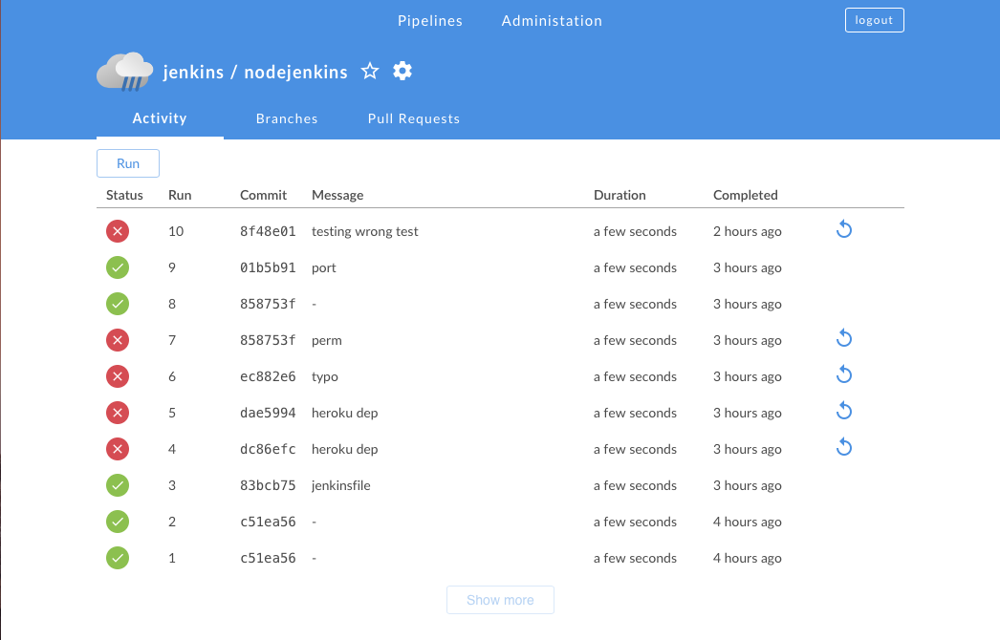
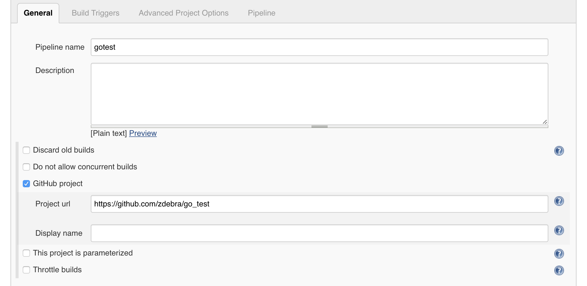

# Jenkins Pipiline Case Study
Zdeněk Brabec  
brabezd1@fel.cvut.cz  
A4M33SEP Softwarové inženýrství pro praxi

## Úvod
Cílem této case study je prozkoumat funkce Jenkins Pipeline. Pro
demonstrování byla vytvořena jednoducha nodejs aplikace. Jenkins
bude muset stáhnut zdrojové soubory, nainstalovat závislosti, 
spustit testy a pak aplikaci nasadit na Heroku.

## Jenkins
Jenkins je open source nástroj pro tzv. _Continous delivery_. Dokáže zautomatizovat
vývojový proces při tvorbě software. Nabízí primárně řešení pro nejpoužívanější
jazyky, ale lze pomocí pluginů jednoduše ohnout a použít pro téměř všechny vývojové
prostředí (jak je ukázano v tomto projektu). Jenkins běží jako standalone
server, takže všechny úkony provadí ve svém diskovém prostoru - podle
toho, kde jej nasadíte. Typické úkony pro _Continous delivery_ jsou build, 
spuštění testů a nasazení. 

Jenkins nabízí grafické rozhraní běžící v prohlížeči, případně _Command line tool_ 
(CLI). Můžete v něm spravovat všehny své projekty.

V tomto projektu bylo využito grafické rozhraní Blue Ocean.

## Pipiline

Pipeline je způsob, jak zadat posloupnost vykonávaných akcí. Definuje se pomocí 
`Jenkinsfile`. To je konfigurační soubor napsaný v Gradle formátu. 

```gradle
node { // <1>
    stage('Build') { // <2>
        /* .. snip .. */
    }
    stage('Test') {
        /* .. snip .. */
    }
    stage('Deploy') {
        /* .. snip .. */
    }
}
```

Tohle je úkázkový příklad takové pipeline. Pomocí `node` alokujete workspace. Jedná
se tedy o omezení scope pro definované proměnné. Následují tři `stage`, tedy
jednotlivé po sobě jdoucí kroky v pipeline. Jenkins nabízí širokou škálu příkazů
(nazývané steps), které lze nalézt v [dokumentaci](https://jenkins.io/doc/pipeline/steps/).

Konfigurační soubor lze uchovávat přímo v repozitáři a Jenkins na něj odkázat, nebo
jej vepsat přímo v grafickém rozhraní v nastavení pipeline. 

V nastavení pipeline jdou dále specifikovat tzv. _Build Triggers_, tedy události, kdy se
má pipeline spouštět. Lze nastavit, že se pipeline bude provádět s nějakou periodicitou,
nebo například Github webhook (Jenkins pozná, že do určité větve v repozitáři byl 
pushnut nový commit).

## Ukázková pipeline

Jednoduchá _Hello World_ aplikace napsaná v `nodejs` je v 
[github repozitáři](https://github.com/zdebra/jenkinspipeline). Jenkins musí umět
stáhnout a závislosti a pak spustit testy. K tomu bude potřeba 
[nodejs plugin](https://wiki.jenkins-ci.org/display/JENKINS/NodeJS+Plugin). Dále 
musí umět deploy na Heroku. K tomu je zapotřebí 
[heroku plugin](https://wiki.jenkins-ci.org/display/JENKINS/Heroku+Plugin).

### Jenkinsfile
```
node {
    stage('Pulling the repo') {
        git url: "https://github.com/zdebra/jenkinspipeline.git"
    }
    stage('Installing dependencies') {
        sh "npm i"
    }
    stage('Test') {
        sh "npm test"
    }
    stage('Deploy') {
        sh script: "./deploy.sh"
    }
}
```
Úkazková pipeline se skládá ze 4 kroků: stáhnutí zdrojových kódů z repozitáře, 
nainstalování závislostí, spuštění testů, nasazení.

### Výsledek
Jenkins přehledně zobrazí výsledky každého buildu. Dozvíte se, jak dlouho build trval, 
kdy proběhl, lze sledovat detaily jednotlivých stage.

## Závěr
Jenkins je hodně nápomocný při tvorbě software. Postará se o repetetivní úkony,
umí monitorovat, odesílat notifikace a mnohé další. Nepodařilo se mi rozběhnout,
aby se build spustil jako github webhook trigger. Předpokládám, že šlo o špatnou
konfiguraci Jenkinse běžícího na localhostu. Jako nedostatek vidím to, že protože
jsem používal nodejs, který není Jenkinsem v základu podprován, tak se výsledky
testů nezobrazují v záložce testů. Tohle například konkurence v podobě _CircleCI_ 
umí.

   


  


\  


